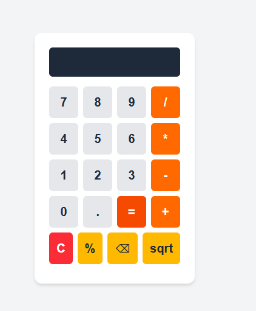

# Calculator

A modern, functional, and aesthetically pleasing calculator application built with React.js and styled using Tailwind CSS.

## ✨ Features

* **Basic Arithmetic Operations:** Supports addition, subtraction, multiplication, and division.
* **Clear Functionality:** 'C' button to clear the entire display.
* **Backspace:** '⌫' button to remove the last digit.
* **Square Root:** 'sqrt' button to calculate the square root of the current number.
* **Percentage:** '%' button to convert a number to a percentage.
* **Responsive Design:** Adapts to various screen sizes.
* **Elegant UI:** Clean and modern design with clear button states.
* **Error Handling:** Basic error handling for invalid operations (e.g., multiple operators, division by zero).

## 🚀 Technologies Used

* [React.js](https://react.dev/) - A JavaScript library for building user interfaces.
* [Next.js](https://nextjs.org/) (if applicable, based on your `use client` directive) - React framework for production.
* [Tailwind CSS](https://tailwindcss.com/) - A utility-first CSS framework for rapid UI development.
* JavaScript (ES6+)

## 💻 How to Run Locally

Follow these steps to set up and run the project on your local machine:

1.  **Clone the repository:**
    ```bash
    git clone [https://github.com/nnneh/react-calculator.git]
    cd calculator
    ```
2.  **Install dependencies:**
    ```bash
    npm install # or yarn install
    ```
3.  **Start the development server:**
    ```bash
    npm run dev # or yarn dev
    ```
4.  Open your browser and visit `http://localhost:3000` (or whatever port your development server runs on).

## 🖼️ Screenshot

[](calculator\public\calculatorimage.png)
